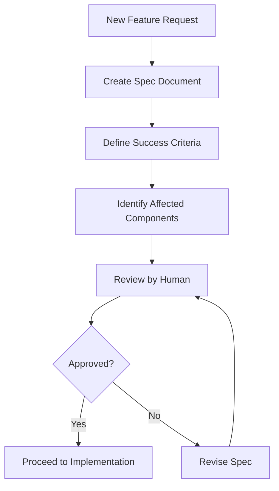

# HistTUI Project Context & Planning System

## Overview

This document defines the **agent-driven development system** for HistTUI. It ensures AI agents:
1. **Plan before building** - Create specs and plans that guide development
2. **Maintain context** - Follow style guides, tech stack, and product goals
3. **Iterate safely** - Review plans before writing code
4. **Work as a team** - Share project context and best practices
5. **Build on existing** - Use existing code to inform decisions

---

## 1. Project Identity

### What is HistTUI?

HistTUI is an **AI-powered, generative Git history TUI** (Terminal User Interface) that combines:
- Beautiful Material Design 3 themed terminal interface
- Interactive repository exploration with vim-style navigation
- Real-time AI insights via AG-UI protocol
- Multi-repository management
- Neurodiversity-friendly design principles

### Core Value Proposition

**For developers:** Explore Git history intuitively with AI-powered insights, stunning visuals, and keyboard-first UX inspired by lazygit, k9s, and tig.

**For AI agents:** A comprehensive, agent-aware codebase with dual-audience documentation, explicit automation instructions, and generative UI capabilities.

---

## 2. Tech Stack & Architecture

### Primary Stack

| Layer | Technology | Version | Purpose |
|-------|-----------|---------|---------|
| **UI Framework** | Ink | 4.x | React for terminals |
| **Component Library** | @inkjs/ui | 2.0.0 | Pre-built terminal components |
| **Language** | TypeScript | 5.x | Type safety |
| **Runtime** | Bun / Node.js | 18+ | Fast JavaScript runtime |
| **Database** | better-sqlite3 | Latest | Local indexing |
| **Git Operations** | simple-git | Latest | Git command interface |
| **AI Protocol** | AG-UI | Latest | Generative terminal UI |
| **Design System** | Material Design 3 | - | Color & motion system |
| **Color Engine** | @material/material-color-utilities | Latest | Dynamic theming |

### Architecture Layers

```
┌─────────────────────────────────────────────────────┐
│  CLI Entrypoint (src/cli.ts)                       │
│  • Argument parsing • Initialization               │
└─────────────────────────────────────────────────────┘
                        ↓
┌─────────────────────────────────────────────────────┐
│  Setup Flow (First Launch)                         │
│  • Repository input • LLM configuration wizard     │
└─────────────────────────────────────────────────────┘
                        ↓
┌──────────────────┬──────────────────┬───────────────┐
│  Git Layer       │  Database Layer  │  Cache Layer  │
│  (read-only)     │  (SQLite)        │  (multi-repo) │
└──────────────────┴──────────────────┴───────────────┘
                        ↓
┌─────────────────────────────────────────────────────┐
│  Indexer (src/core/indexer/)                       │
│  • Coordinates Git → Database                      │
└─────────────────────────────────────────────────────┘
                        ↓
┌─────────────────────────────────────────────────────┐
│  UI Layer (Ink + @inkjs/ui + Material Design 3)   │
│  ├─ ThemeProvider (MD3 dynamic colors)            │
│  ├─ AGUIProvider (generative UI)                  │
│  ├─ AppProvider (app state)                       │
│  └─ Screens & Components                          │
└─────────────────────────────────────────────────────┘
                        ↓
┌─────────────────────────────────────────────────────┐
│  Plugin System (src/plugins/)                      │
│  • AI Assistant • Custom extensions               │
└─────────────────────────────────────────────────────┘
                        ↓
┌─────────────────────────────────────────────────────┐
│  AG-UI Agent Backend (agent-server/)               │
│  • SSE streaming • LLM integration                 │
└─────────────────────────────────────────────────────┘
```

### Key Principles

1. **Read-Only Git Operations** - Never mutate repositories
2. **Async-Friendly** - Support large repositories without blocking
3. **Keyboard-First UX** - Vim-style navigation everywhere
4. **Material Design 3** - Dynamic theming from source color #6750A4
5. **Dual-Audience Docs** - Serve humans AND AI agents
6. **Plugin Extensibility** - Hook-based plugin system
7. **Neurodiversity-Friendly** - Multiple themes, reduced motion options

---

## 3. Development Workflow

### Phase 1: Planning (REQUIRED before code)



**Required Spec Template:**

```markdown
# Feature: [Name]

## Goal
What problem does this solve? Who benefits?

## Success Criteria
- [ ] Criterion 1
- [ ] Criterion 2
- [ ] Criterion 3

## Affected Components
- Component 1 (path/to/file.ts)
- Component 2 (path/to/file.ts)

## Implementation Plan
1. Step 1
2. Step 2
3. Step 3

## Documentation Updates
- [ ] README.md
- [ ] [Other docs]

## Testing Strategy
- Unit tests: [describe]
- Integration tests: [describe]
- Manual verification: [describe]

## Risks & Mitigation
- Risk 1 → Mitigation strategy
```

### Phase 2: Implementation

1. **Code with context**
   - Follow existing patterns (see `/docs/PATTERNS.md`)
   - Use TypeScript strict mode
   - Maintain Material Design 3 theming
   - Add @inkjs/ui components where applicable

2. **Test continuously**
   - Write tests alongside code
   - Run `npm run test` frequently
   - Manual testing in terminal

3. **Document as you go**
   - Update component docs immediately
   - Add usage examples
   - Update dual-audience sections

### Phase 3: Review & Iterate

1. **Self-review checklist** (see `/docs/REVIEW_CHECKLIST.md`)
2. **Request code review** (agent or human)
3. **Address feedback**
4. **Final verification**

---

## 4. Style Guides

### TypeScript Style

```typescript
// ✅ Good: Explicit types, clear naming
interface CommitData {
  hash: string;
  message: string;
  author: string;
  timestamp: number;
}

export function getCommitData(hash: string): Promise<CommitData> {
  // Implementation
}

// ❌ Bad: Implicit any, vague naming
function getData(h) {
  // Implementation
}
```

### React/Ink Component Style

```typescript
// ✅ Good: Typed props, hooks, Material Design 3 colors
import React, { useState } from 'react';
import { Box, Text } from 'ink';
import { useColorScheme } from '../hooks/useColorScheme';

interface CommitListProps {
  commits: CommitData[];
  onSelect: (hash: string) => void;
}

export function CommitList({ commits, onSelect }: CommitListProps): React.ReactElement {
  const [selected, setSelected] = useState(0);
  const colors = useColorScheme();
  
  return (
    <Box flexDirection="column">
      {commits.map((commit, index) => (
        <Text
          key={commit.hash}
          color={index === selected ? colors.primary : colors.onSurface}
        >
          {commit.message}
        </Text>
      ))}
    </Box>
  );
}
```

### Material Design 3 Color Usage

```typescript
import { useColorScheme } from '../hooks/useColorScheme';

// ✅ Always use dynamic colors from color scheme
const colors = useColorScheme();
<Text color={colors.primary}>Primary Text</Text>
<Text color={colors.onSurface}>Regular Text</Text>
<Box borderColor={colors.outline}>...</Box>

// ❌ Never hardcode colors
<Text color="#6750A4">Text</Text> // Wrong!
```

### Documentation Style

**For Humans:**
- Emoji section headers
- Conversational tone
- Benefits-first descriptions
- Real examples

**For AI Agents:**
- Collapsible `<details>` sections
- Step-by-step numbered instructions
- Copy-paste bash commands
- Verification procedures

---

## 5. Product Goals & Priorities

### Primary Goals

1. **Best-in-class Git TUI** - Match/exceed lazygit, tig, gitui
2. **AI-powered insights** - Real-time suggestions via AG-UI
3. **Beautiful design** - Material Design 3, smooth animations
4. **Accessibility** - Neurodiversity-friendly, keyboard-first
5. **Multi-repo support** - Seamlessly switch between repositories

### Feature Prioritization

| Priority | Category | Features |
|----------|----------|----------|
| **P0** | Core | Commit timeline, file tree, diff viewer |
| **P1** | AI | AG-UI integration, setup wizard, streaming insights |
| **P2** | UX | Multi-repo manager, fuzzy search, Material Design 3 |
| **P3** | Extensibility | Plugin system, custom themes |
| **P4** | Nice-to-have | GitHub integration, code metrics, blame view |

### Non-Goals

- ❌ Git write operations (commits, pushes, merges)
- ❌ Web interface (terminal only)
- ❌ Cloud storage (local only)

---

## 6. Agent Collaboration

### Shared Context Files

All agents should read these before starting work:

1. **PROJECT_CONTEXT.md** (this file) - Project identity, goals, stack
2. **ARCHITECTURE.md** - Technical architecture deep-dive
3. **PATTERNS.md** - Code patterns and conventions
4. **REVIEW_CHECKLIST.md** - Pre-commit review checklist
5. **.github/agents/*.md** - Agent-specific instructions

### Inter-Agent Communication

```markdown
# Pattern: Agent Handoff

Agent A (Planning):
- Creates spec in /specs/feature-name.md
- Tags: @agent-b for implementation

Agent B (Implementation):
- Reads spec
- Implements feature
- Updates spec with implementation notes
- Tags: @agent-c for review

Agent C (Review):
- Reviews against spec
- Provides feedback
- Tags: @agent-b if changes needed
- Approves if ready
```

### Agent Specializations

| Agent | Role | Expertise |
|-------|------|-----------|
| **histtui-maintainer** | Documentation & Code Maintenance | Dual-audience docs, commit messages, sync |
| **histtui-architect** | Architecture & Design | Component structure, patterns, tech decisions |
| **histtui-reviewer** | Code Review & Quality | Testing, security, performance, style |
| **histtui-ui** | UI/UX & Material Design 3 | Components, theming, animations, accessibility |

---

## 7. Decision Log

### ADR (Architecture Decision Records)

Format: `/docs/decisions/NNNN-title.md`

```markdown
# ADR-0001: Use Material Design 3 for Color System

## Status
Accepted

## Context
Need dynamic, accessible color theming for terminal UI.

## Decision
Use @material/material-color-utilities to generate MD3 schemes from source color #6750A4.

## Consequences
- ✅ Professional, cohesive design
- ✅ Accessibility features built-in
- ✅ Dynamic theming from single color
- ⚠️ Terminal color limitations require adaptation
```

### Key Decisions (Summary)

| Decision | Date | Rationale |
|----------|------|-----------|
| Material Design 3 | 2026-01 | Professional design system, accessibility |
| @inkjs/ui | 2026-01 | Pre-built components, consistency |
| AG-UI Protocol | 2026-01 | Terminal-native generative UI |
| Bun Runtime | 2026-01 | Fast development, Node.js compatible |
| Source Color #6750A4 | 2026-01 | Brand identity, expressive purple |

---

## 8. Safe Iteration Process

### Before Making Changes

```bash
# 1. Read current state
cat PROJECT_CONTEXT.md
cat ARCHITECTURE.md
cat src/path/to/relevant/file.ts

# 2. Create spec
vim specs/my-feature.md

# 3. Get approval
# (Human reviews spec)
```

### During Implementation

```bash
# 1. Implement in small chunks
# 2. Test each chunk
npm run test
npm run dev

# 3. Document as you go
vim docs/COMPONENTS.md

# 4. Commit with proper format
git add .
git commit -m "✨ feat: Add feature X"
```

### After Implementation

```bash
# 1. Run full test suite
npm run test

# 2. Build project
npm run build

# 3. Manual verification
npm run dev -- https://github.com/test/repo

# 4. Update documentation
npm run docs:check

# 5. Create PR
git push origin feature-branch
```

---

## 9. Using Existing Code

### Code Discovery

```bash
# Find similar components
grep -r "similar-pattern" src/

# Find usage examples
grep -r "ComponentName" src/

# Check tests
find src/ -name "*.test.ts"
```

### Pattern Extraction

When implementing new features:

1. **Find similar existing feature**
2. **Extract the pattern** (naming, structure, types)
3. **Apply pattern to new feature**
4. **Document the pattern** if novel

### Code Reuse Checklist

- [ ] Is there an existing component I can extend?
- [ ] Is there a similar pattern I can follow?
- [ ] Are there utility functions I can use?
- [ ] Are there types I can reuse/extend?
- [ ] Can I extract common logic into a shared module?

---

## 10. Onboarding New Agents

### Agent Setup Checklist

```markdown
- [ ] Read PROJECT_CONTEXT.md (this file)
- [ ] Read ARCHITECTURE.md
- [ ] Read PATTERNS.md
- [ ] Read your agent-specific guide (.github/agents/[name].md)
- [ ] Review recent specs (/specs/)
- [ ] Review recent ADRs (/docs/decisions/)
- [ ] Check current priorities (PROJECT_CONTEXT.md section 5)
- [ ] Understand review process (REVIEW_CHECKLIST.md)
```

### First Task Guidelines

1. **Start small** - Pick a P3/P4 feature or documentation task
2. **Create a spec** - Even for small tasks
3. **Ask questions** - Before making assumptions
4. **Follow patterns** - Use existing code as reference
5. **Document learnings** - Update guides with new insights

---

## 11. Maintenance & Evolution

### Context Updates

This document should be updated when:
- New major features are added
- Tech stack changes
- Architecture patterns change
- Product priorities shift
- New agents join the team

### Review Cadence

- **Weekly:** Check context alignment
- **Monthly:** Review and update goals
- **Quarterly:** Major architecture review
- **Annually:** Tech stack evaluation

---

## 12. Quick Reference

### Essential Commands

```bash
# Development
npm run dev -- <repo-url>              # Run HistTUI
npm run launch                          # Run with AG-UI agent
npm run test                            # Run tests
npm run build                           # Build project
npm run typecheck                       # Check TypeScript

# Documentation
npm run docs:check                      # Verify docs
npm run docs:generate                   # Generate API docs

# Agent
npm run agent                           # Start AG-UI server only
```

### Essential Files

- `PROJECT_CONTEXT.md` - This file
- `ARCHITECTURE.md` - Technical architecture
- `src/config/color-engine.ts` - MD3 color system
- `src/config/themes.ts` - Theme definitions
- `src/components/App.tsx` - Root component
- `agent-server/server.ts` - AG-UI backend

### Getting Help

1. Check `/docs/` directory
2. Review `/specs/` for examples
3. Ask in agent communication channel
4. Tag @histtui-maintainer for docs
5. Tag @histtui-architect for architecture

---

**Version:** 1.0  
**Last Updated:** 2026-01-14  
**Maintained By:** histtui-maintainer agent
